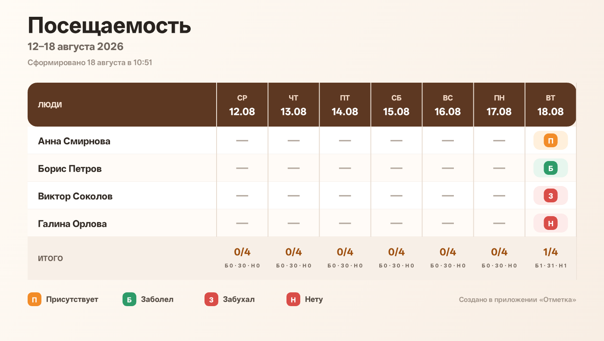

# Отметка

An offline-first, installable attendance PWA with a fully Russian interface. It is designed for one fast daily flow: open it, tap only the exceptions, and open the native share sheet with a seven-day PNG already attached.

Live app: **https://usersv4.github.io/attendance-pwa/**



## What it does

- Keeps an editable, reorderable roster on the device.
- Shows `Присутствует` in orange, `Заболел` in green, and both `Забухал` and `Нету` in red.
- Makes every deliberate choice that person's default for the next new day.
- Initializes today from those defaults; days never opened remain unknown (`—`).
- Stores history indefinitely while the current UI and PNG show the latest seven days.
- Pre-renders the overview so one tap can immediately call `navigator.share({ files })`.
- Archives removed people without destroying their recent history.
- Exports and restores a versioned JSON backup.
- Uses no API, CDN, remote font, analytics, or runtime network dependency.

## Install on iPhone

1. Open the live app in Safari.
2. Tap **Share** → **Add to Home Screen** → **Add**.
3. Open **Отметка** from the Home Screen once while online.
4. Wait for **Готово офлайн · интернет больше не нужен**.

From then on, the roster, seven-day history, editing, and PNG generation work offline. Sending the PNG through a messenger naturally still needs whatever connectivity that messenger requires.

iOS does not allow a website to trigger installation or silently choose/send to a messenger. The app therefore uses the shortest browser-permitted flow: one tap opens the native share sheet with the image attached.

Home Screen web-app storage is isolated from the original Safari tab on current iOS, which is why the UI tells iPhone users to install before entering their roster. Browser storage also cannot survive uninstalling the app, clearing site data, or every possible low-storage eviction; the included JSON backup is the recovery path.

## Local development

The app is deliberately build-free and dependency-free.

```sh
npm start
npm test
npm run check
```

`npm run smoke:browser` runs the mobile/offline browser scenario against a Chromium DevTools endpoint. Set `CDP_URL` and `APP_URL` when they differ from `http://127.0.0.1:9222` and `http://127.0.0.1:4173/`.

When changing any precached runtime file after a release, increment `CACHE_NAME` in `sw.js` so installed copies update atomically.

## Privacy

All names and attendance data stay in IndexedDB with a localStorage resilience mirror. There is no server-side database and no telemetry.
